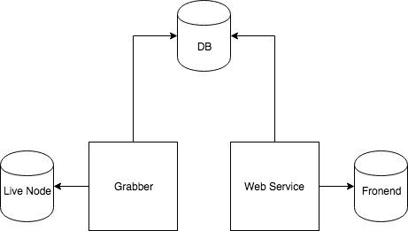

# General description

Here is the scheme of how this explorer works.

It consinsts of two 3 main parts

* Grabber
* Database
* WebService

### Grabber

Grabber is responsible for retrieving data from blockchain node.
How it works:
on start grabber check what the last height has been grabbed from node and compares it to the the last height stored in db.

### Database

It's a postgres node. Plain sql database. Grabber is writing data here, and WebService reading data from this database.
We use evolutions to keep sql schema updated. You can find then in `/resources/db` folder.

For evolutions we are using flyway-sbt plugin.
You can read more details [here](https://github.com/flyway/flyway-sbt)

There is `DbConfig.scala` class which represents corresponding section of `application.conf` file.
Most interesting option here is `migrateOnStart`. If it sets to `true` on start app will clean db and apply all db evolutions.
If it sets to `false` - db won't be cleaned and evolutions won't be applied.

### WebService

WebService reads data from db and give it to the frontend in needful format.
Main responsibility of WebService is to find and format data into json response.
  